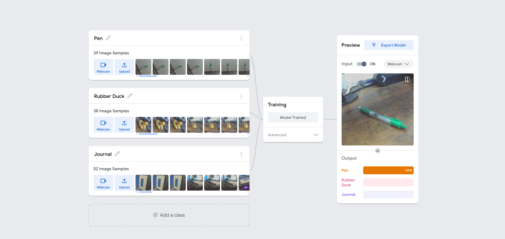

# Desk Object Sorter – Teachable Machine Project

## Project Description
This project uses Google’s Teachable Machine to train a model that can recognize three common desk items using webcam images. It covers data collection, training, testing, and exporting the model for reuse.

## Classes Identified
Pen  
Rubber Duck  
Journal

## Discussion and Reflection

### 1. Model performance and changes made
The first version of the model was decent, but it got a little confused when the journal was flipped. I added a few more shots from different angles and retrained it. After that, it picked things up more easily and the confidence scores went up.

### 2. Challenges and what I noticed
The rubber duck was the easiest one to recognize. It’s bright, has a unique shape, and stood out every time. The journal gave it the most trouble, especially when it wasn’t upright. When I tested random stuff the model hadn’t seen, it gave lower confidence scores, which actually shows it’s doing its job instead of guessing.

### 3. Bias in AI
If the training images are too specific or too consistent, the model struggles with anything outside that pattern. Like if all the shots are from the same angle or in the same lighting, it won’t handle real-world variation well. That shows how bias can creep in through training choices.

### 4. Limits and why the model matters
The model only knows what it’s seen. Anything outside those objects confuses it. But being able to download and share the model files makes it easy to use in other projects or demos. It’s quick to train and flexible enough for basic tasks.

### 5. Real-world uses and ethical stuff
A model like this could help with simple inventory tasks, organizing stuff in classrooms or offices, or even sorting items on a small production line. Developers just need to think ahead about how it’s used. If it gets something wrong in a serious situation, that could be a problem.

## Extra notes
I thought it was cool how just a few extra images made a big difference. You don’t always need more sometimes you just need better variety.

## Screenshot

